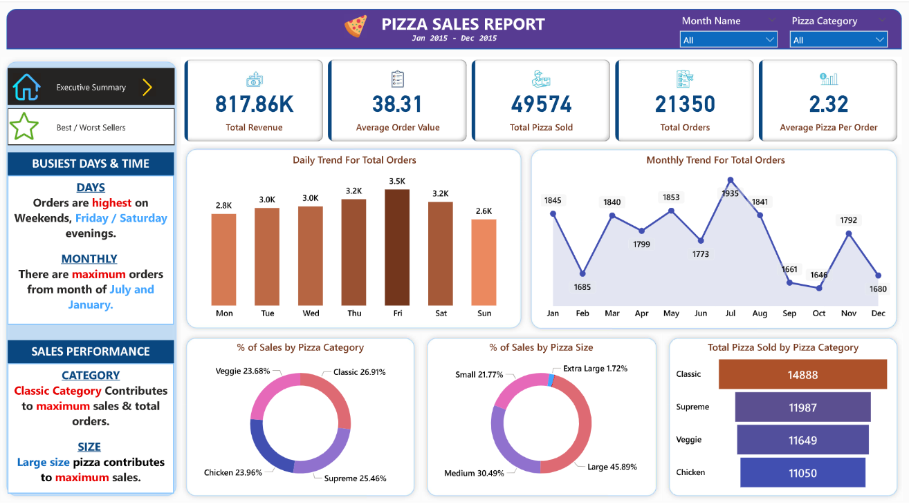
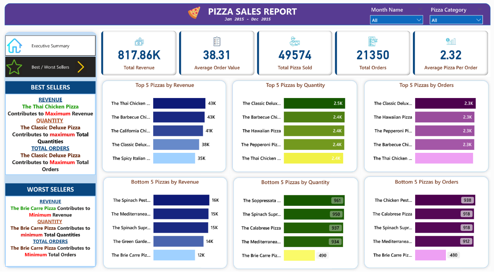

# Pizza Sales Analysis – Power BI & SQL Server
  
It focuses on analyzing a **Pizza Sales Report** using **Power BI** for visualization and **SQL Server** as the data source.  

The goal of this project is to practice **data visualization, dashboard design, and analytics techniques** by transforming raw sales data into meaningful business insights.

---

## 🔑 Key Learnings
- Connecting **SQL Server** data with **Power BI**  
- Building interactive dashboards for sales performance  
- Performing **data cleaning, transformation, and modeling**  
- Applying DAX for calculated measures and KPIs  
- Visualizing insights such as:
  - Best-selling pizzas  
  - Revenue trends  
  - Customer purchasing patterns
  
---

## 📊 Project View

---

## 📊 Dashboard Preview
👉 [Click here to view the project](https://app.powerbi.com/view?r=eyJrIjoiM2Y3M2QwNTgtMTVlZi00ZmU4LTg0M2MtZGY0NTNmZDlhNjUyIiwidCI6IjFlYjk4MmNlLThkZTgtNDllMi1iMDA4LTNiYjJmYjg1NzU1YyJ9)

---

## 🙏 Acknowledgement
A huge thanks to **Mr. Swapnjeet** for creating valuable tutorials and contributing to the learning community through the Data Tutorials channel.  

---

## 🚀 How to Use
1. Clone/download the project files.  
2. Open the `.pbix` file in **Power BI Desktop**.  
3. Connect to the provided **SQL Server database** (or replace with your own).  
4. Explore, customize, and extend the analysis.  

---

## 📌 Requirements
- **Power BI Desktop**  
- **SQL Server** (for database connection)  

---

## 💡 About This Project
This project is purely for **educational and learning purposes**.  
It helped me gain hands-on experience in **Power BI, SQL Server, and business analytics.**

---
